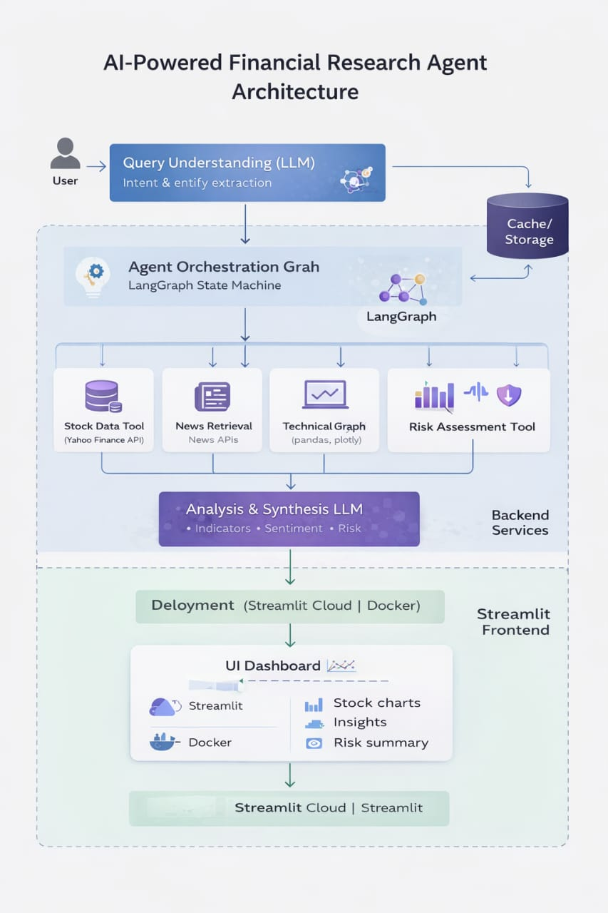

# financial-research-ai-agent
## Overview
An intelligent financial research agent built using LangGraph for orchestration and Streamlit for visualization. The system dynamically selects tools, performs technical analysis, and generates structured financial insights.

## Tech Stack
- Python
- LangChain
- LangGraph
- Streamlit
- yfinance
- Plotly

## System Architecture

Detailed explanation available in:
[Architecture Documentation](docs/architecture.md)

## Features
- Real-time stock data analysis
- Technical indicators (RSI, Moving Averages)
- Sentiment analysis
- Risk assessment
- Modular agent graph design

## Deployment
(Insert Streamlit Cloud link here)

## Future Improvements
- Vector database integration
- RAG for financial reports
- Multi-agent collaboration
- Docker deployment
